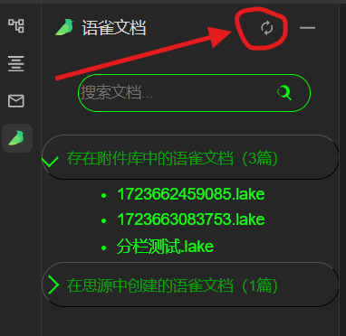

## Introduction

You can open/edit the lake format language document you quoted in your notes in a local offline environment

### Click on the Yuque icon in the upper left corner to provide the following functions

1. Create a new language document in lake format

2. View the attachments in the entire library and your newly created language documents, and click the lake file inserted in the notes

3. Edit attachments in the entire library and your own new language documents, and support inserting attachments

4. Refresh the Siyuan interface

### The bird icon in the dock bar on the left side supports viewing the entire library documents. You can constantly click the refresh button to obtain real-time data. 

## Pay attention

> 1. This offline plug-in has almost all the editing functions of lake documents, but it cannot completely replace Yuque.

> 2. Attachments inserted into lake documents need to be switched to preview mode before they can be downloaded, and pictures and videos can be downloaded directly

> 3. If your lark document is in the attachment library, then be sure to quote it in your Siyuan Notes, otherwise it will appear in the unreferenced resource file of Siyuan Notes. This plug-in does not provide references, and you need to manually reference them to prevent them from being cleaned up.

> 4. The Yuque document created through the plug-in is not in the attachment library of Siyuan Notes, so it will not be detected and cleaned. The document body is under `data\public\lark-editor\lark`, and the attachments inserted into the document are under `data\public\lark-editor\larkattachments\{note creation timestamp}` 