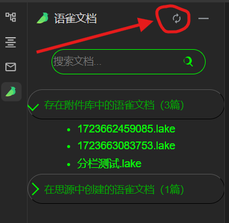

[更新日志](CHANGELOG.md)

## 介绍

可以在本地离线环境下，在思源笔记里打开/编辑你在笔记里引用的lake格式的语雀文档

### 左上角点击语雀图标，提供以下功能

1. 新建lake格式的语雀文档

2. 查看全库附件中和自己新建的语雀文档，点击笔记中插入的lake文件即可

3. 编辑全库附件中和自己新建的语雀文档，并且支持插入附件

4. 刷新思源界面

### 左侧边上的dock栏语雀图标支持查看全库语雀文档，你可以不断点击刷新键来获取实时数据

## 注意
> 1. 本离线插件几乎拥有lake文档所有编辑功能，但并不能完全完全代替语雀

> 2. 插入lake文档的附件需要切换到预览模式才能点击下载，图片和视频则直接可以下载

> 3. 如果你的lark文档在附件库里面，那么一定要在你的思源笔记里面引用一下，否则它会出现在思源笔记的未引用的资源文件里面，本插件不提供引用，需要你手动引用防止被清理

> 4. 通过插件创建的语雀文档，不在思源笔记的附件库里面，所以不会被检测清理，文档本体在`data\public\lark-editor\lark`下面，插入文档的附件在`data\public\lark-editor\larkattachments\{笔记创建时间戳}`下面